# AuroraGPT-2B Pre-Training Report

Local reproduction of the
[AuroraGPT-2B Pre-Training](https://api.wandb.ai/links/aurora_gpt/zyabwz9i)
Weights & Biases report.

The plots below are regenerated from the live `aurora_gpt/AuroraGPT` W&B
project using
[`scripts/generate_report.py`](scripts/generate_report.py) and rendered with
[ambivalent](https://github.com/saforem2/ambivalent) styling. Run the script
to refresh the figures whenever new runs land:

```bash
.venv-report/bin/python ALCF/AuroraGPT/2B/scripts/generate_report.py
```

## Runs included

The same 22-clause filter as the report:

- `username = foremans`
- `createdAt >= 2025-08-20`
- `optimizer = sophiag`
- `rope_theta = 50000`, `zero_stage = 0`, `checkpoint_activations = false`
- `micro_batch_size = 1`, `gradient_accumulation_steps >= 2`
- `world_size IN {3072, 6240}`, `num_layers IN {4..20}`
- `tokenizer_model = google/gemma-7b`
- summary `loss/lm loss` is not `NaN`
- tag is not `cooldown`
- `data_file_list NOT IN {books.txt, nvidia-math1-code2.txt}`
- excluded: `treasured-thunder-4350`, `grateful-dust-4351`, `glowing-disco-4352`,
  `happy-surf-4362`, `laced-puddle-4445`, `sage-universe-4443`, `dandy-sea-4440`,
  `twilight-dream-4439`, `vibrant-glitter-4358`, `dulcet-forest-4361`,
  `copper-pyramid-4359`, `lemon-aardvark-4360`, `sleek-tree-4390`,
  `autumn-sea-4394`

Curves are grouped by
`(machine, NHOSTS, torch_version, global_batch_size, optimizer, data_file_list)`
so each line represents one training segment / data mixture.

## Loss

### LM loss vs. consumed tokens (log y)

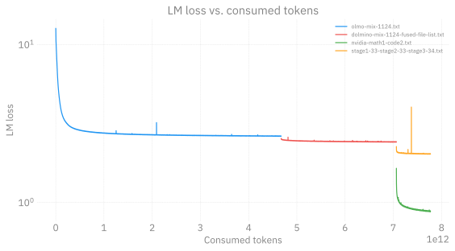

### LM loss vs. consumed tokens (linear y)

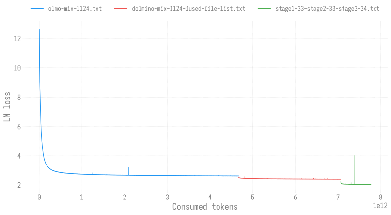

### Gradient norm vs. consumed tokens

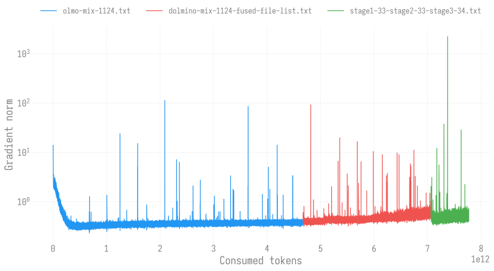

### Validation LM loss vs. iteration

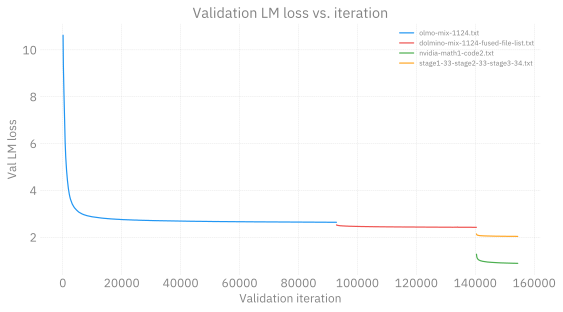

## Learning rate

### Learning rate vs. iteration (linear)

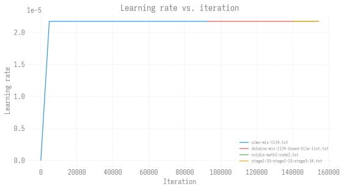

### Learning rate vs. iteration (log-log)

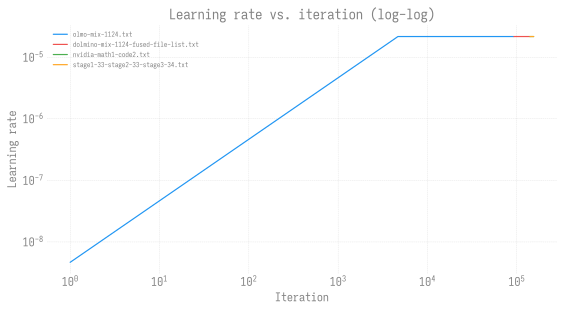

## Throughput

### Iteration time vs. wall time

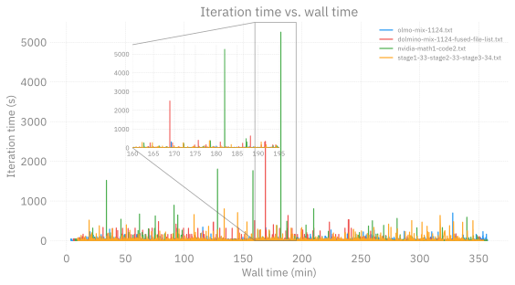

### Iteration time vs. wall time (zoomed to 0–5 s)


### Tokens / sec vs. iteration

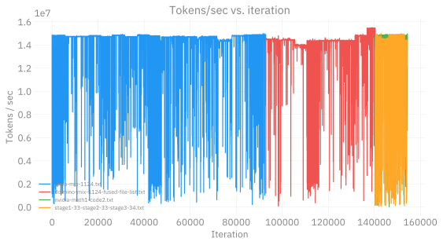

### Tokens / GPU / sec vs. iteration


### TFLOPs vs. wall time

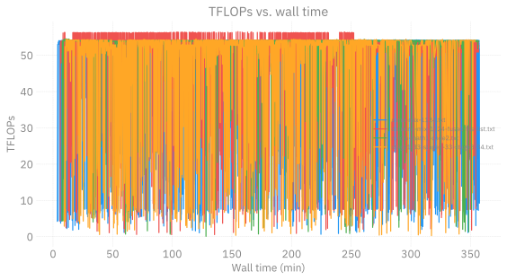

## Progress

### Approx. parameters in billions vs. wall time

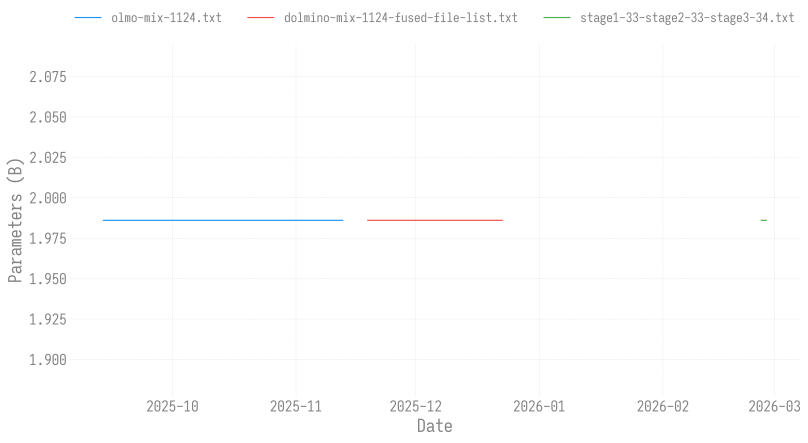

### Consumed tokens vs. wall time

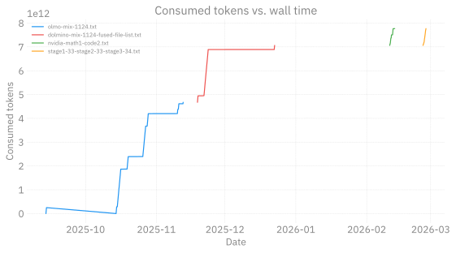
