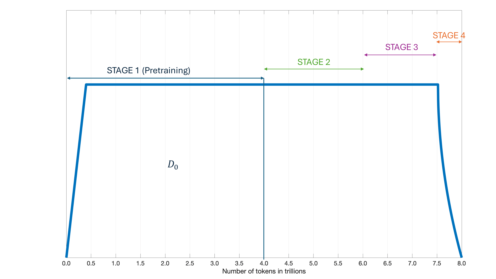
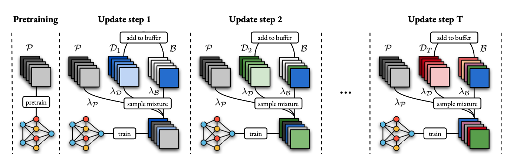
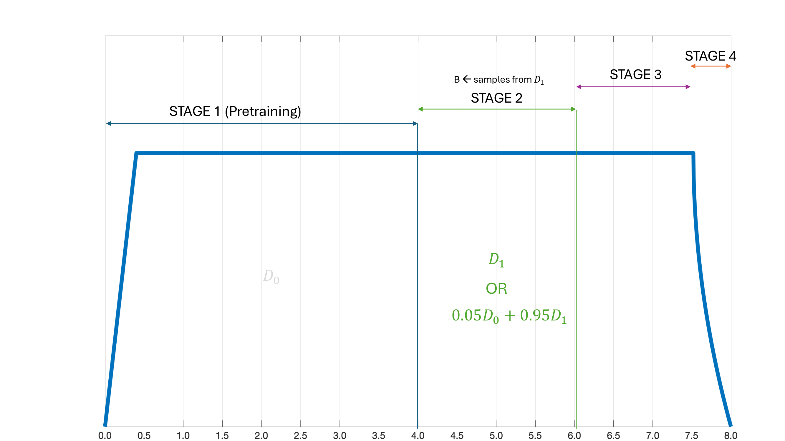
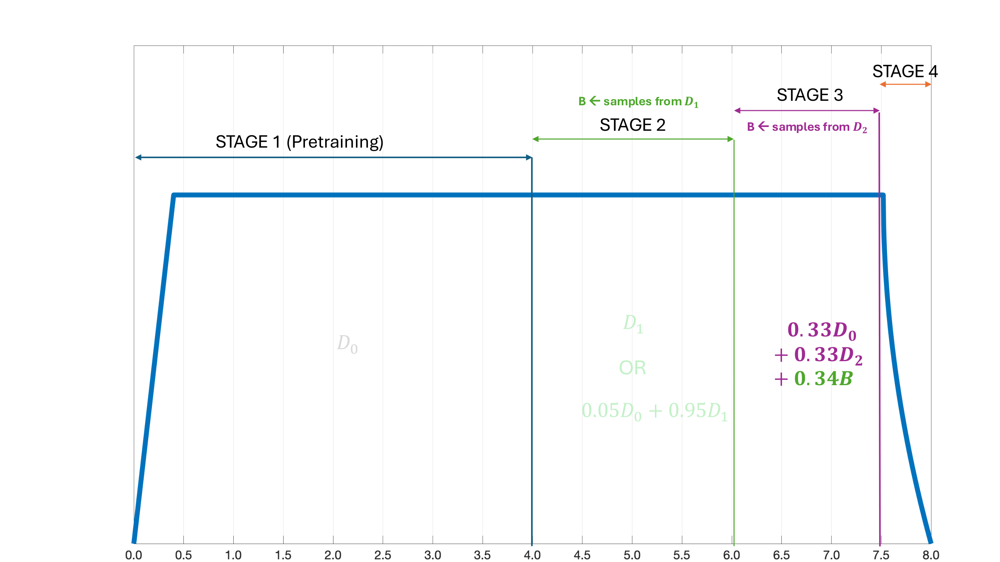
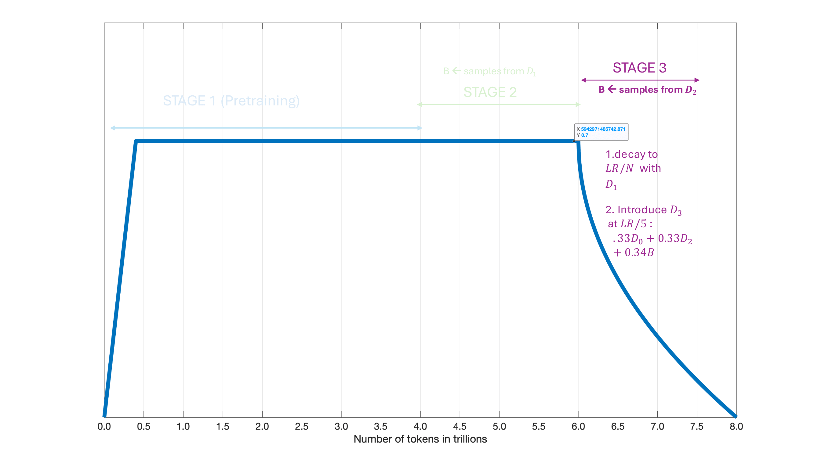
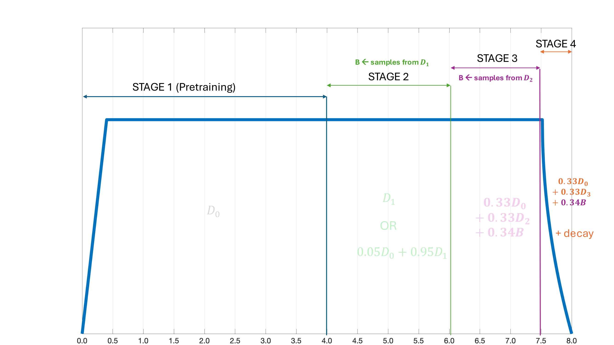

# CPT
This document serves as a strategy cookbook for our current runs. 
CPT is the process of continually pre-training a model on new data. The goal of CPT is to continue training on new data while retaining previously learned knowledge and avoiding forgetting. When compared to finetuning, the goal of CPT is not to improve the model knowledge and performance on a given downstream task but to retain and improve current knowledge as more data are being streamed while avoiding catastrophic forgetting.
In this document, we focus on three CPT approaches: a **data centric strategy**, an **optimization (LR) strategy**. This means that the following are **fixed** across all runs:
- Model architecture
- Sequence length
- Optimizer (although it might be interesting testing how changing optimizers across stages affect training)
- All hyperparameters besides the LR
- Evaluation/validation tasks (needs to be fixed from the start and be consistent across stages)

In all that follows, we suppose the base model was trained on dataset $D_0$ and label the subsequent datasets $D_i$, $i = 1\cdotsN$. What it means for us is that stage 1 is training with $D_0$, stage 2 is training with $D_1$, stage 3 with $D_3$ and stage 4 with $D_3$. We call the training data used to do CPT at stage i $D^{CPT}_{i}$ A CPT strategy for the legacy model (agpt-7B) can be found at the end of the document.

## AuroraGPT V1 (Stages 1 to 4)

For these runs, we have 4 stages of training with the first stage producing the pretrained or base model. A key element here is the learning rate scheduler that we are using. In fact, as opposed to the legacy model, we used an infinite scheduler where the LR was warmed up to $LR_{max}$ then kept constant before cooling it down to convergence. The main advantage of this is to avoid rewarming the LR when doing CPT which can lead to instabilities. Therefore, we mostly adopt a data centric strategy here but might resort to playing with the LRs if needed. The dataset $D_0$ for pretraining is Olmo-mix and has 4 Trillion tokens, then $D_1$ has 2 Trillion tokens from Dolmino and fineweb Edu meaning the data distribution between these two stages is weak. We then have $D_2$ for stage 3 that has 1.5 trillion tokens from math, code, ans science papers. Finally, we have $D_3$ stage 4 made of 0.5 trillion tokens from reasoning traces. 

| Stage | Dataset Symbol | Size | Source / Path | Notes |
|------:|----------------|----------------------|---------------|-------|
| 0 | D₀ |  4T | Olmo-mix | Stage 1 (Pretraining) |
| 1 | D₁ | 2T | Dolmino and fineweb Edu | Stage 2 |
| 2 | D₂ | 1.5T |Open Alex, and proof pile II | Stage 3 |
| 3 | D₃ | 0.5T |OpenMathInstruct, CoT Collection, AQUA-RAT, Llama-Nemotron Dataset, GSM8K, OpenHermes  | Stage 4 |

## Data centric strategy ##
The main thing to figure out here is the data mixing strategy. To avoid catastrophic forgetting, we need to sample from the pretraining dataset $D_0$, the current one $D_i$, and we also might need to sample from a buffer $B$ that contains data from the previous stages $D_1,\cdots,D_{i-1}$. Which means we need sampling weights $\alpha_0$ for the pretraining data, $\alpha_D$ for the current dataset, and $\alpha_B$ for the buffer dataset with $\alpha_0 + \alpha_D + \alpha_D = 1$.
See the figure below from this [paper](https://arxiv.org/pdf/2408.14471)

Note that you add data to the buffer B after the current step to be used for the next one i.e at sampling time, B only contains data from previous stages.

#### Stage 1 to stage 2 (weak distribution shift)
##### Strategy 1: No replay
`Important: USE A CHECKPOINT AT LR=LR_max i.e. BEFORE COOLING DOWN`.

Naively continue training with $D_1$, no replay data. 
- Continue training using only the current dataset $D_1$
- No replay from $D_0$ or buffer data
This may be sufficient under weak distribution shift but there is potential risks of forgetting

##### Strategy 2: Replay from pretraining dataset
`Important: USE A CHECKPOINT AT LR=LR_max i.e. BEFORE COOLING DOWN`. Then,
###### Replay the pretraining dataset
 We mix data from:
- the pretraining dataset $D_0$,
- the current CPT dataset $D_1$.

No buffer data is used at this stage, $\alpha_B=0$.

Initial mixing weight
- Start conservatively:
  - $\alpha_0 = 0.05$–$0.10$
  - $\alpha_D = 1 - \alpha_0$
> In practice, $\alpha_0 = 0.05$ is often a safe starting point.
> Increase up to 25–30% only if forgetting is observed.



**Dataset construction**
   Use [mix_datasets.py](https://github.com/zhenghh04/blendcorpus/blob/main/utils/mix_datasets.py) function to build your cpt dataset. For example, to mix the lucid papers with weight 0.9 and the dolma dataset with weight 0.1, you do
 ```bash
python3 mix_datasets.py --input 0.9 /flare/Aurora_deployment/AuroraGPT/datasets/papers/papers.txt 0.1 /flare/Aurora_deployment/AuroraGPT/datasets/dolma/dolma_v1_7_file_list_v2.txt > ${debug_dir}/Megatron-DeepSpeed/ALCF/data-lists/aurora/mix_lucid_papers09_dolma01.txt
```
For convenience, here is a copy of the ***mix_datasets.py*** script
```bash
#!/usr/bin/env python3
import argparse
import sys

def parse_args():
    p = argparse.ArgumentParser(
        description="Mix multiple file-lists, normalize internal weights, and apply global file weights."
    )
    p.add_argument(
        '--inputs',
        nargs='+',
        required=True,
        help="Pairs of file_list and global_weight, e.g.: --inputs 0.3  f1.txt 0.7 f2.tx"
    )
    return p.parse_args()


def main():
    args = parse_args()
    inp = args.inputs
    if len(inp) % 2 != 0:
        sys.exit("Error: --inputs must be an even number of arguments (file weight pairs).")

    # Group into (file_path, global_weight)
    pairs = []
    for i in range(0, len(inp), 2):
        file_path = inp[i+1]
        try:
            gw = float(inp[i])
        except ValueError:
            sys.exit(f"Error: global weight must be a number, got '{inp[i]}'")
        if gw <= 0:
            sys.exit(f"Error: global weight must be positive, got {gw}")
        pairs.append((gw, file_path))

    # Compute sum of all global weights (if normalization across files is desired)
    sum_global = sum(gw for gw, _ in pairs)

    for gw, file_path in pairs:
        # Normalized file-level fraction (optional across all files)
        file_fraction = gw / sum_global

        # Read entries and sum file-local weights
        entries = []
        file_sum = 0.0
        try:
            with open(file_path, 'r') as f:
                for line in f:
                    line = line.strip()
                    if not line or line.startswith('#'):
                        continue
                    parts = line.split()
                    if len(parts) < 3:
                        sys.exit(f"Error: each line must have prefix weight corpus, got: '{line}'")
                    prefix = parts[1]
                    try:
                        w = float(parts[0])
                    except ValueError:
                        sys.exit(f"Error: weight must be numeric, got '{parts[1]}' in file {file_path}")
                    corpus = parts[2]
                    entries.append((prefix, w, corpus))
                    file_sum += w
        except FileNotFoundError:
            sys.exit(f"Error: cannot open file '{file_path}'")

        if file_sum <= 0:
            sys.exit(f"Error: sum of weights in file '{file_path}' is non-positive: {file_sum}")

        # Print header only once
        # Compute and print normalized weights
        for prefix, w, corpus in entries:
            new_w = (w / file_sum) * file_fraction
            print(f"{new_w:.6f} {prefix} {corpus}")

if __name__ == '__main__':
    main()
```
2. **Start building the buffer $B$** in prevision of the next stages.
3. **Run CPT**: Load your checkpoint and run CPT with the --finetube flag.
Note that you might need to convert your checkpoints following [these instructions](https://github.com/argonne-lcf/Megatron-DeepSpeed/blob/main/ALCF/notes/universal_checkpoint_bug.md) to a universal checkpoint.

At the end of this stage, we have ***$D^{CPT}_1$***.


#### Stage 2 to stage 3 (shift to math/code datasets)
##### Naive strategy
You can try the naive approach but it might not work here, stop early if loss does not recover.
##### Strategy 2
Mix in the final dataset $D^{CPT}_1$ used in Stage 1.
1. Construct a mixed dataset containing the final dataset $D^{CPT}_1$ used in stage 2 and $D_3$.
2. Follow the same procedure as in the previous mixing strategy. At this point, the model has seen 6T tokens and $D_3$ contains 1.5T. Here, give $D_3$ less weight.
##### Strategy 3

If the loss is not recovering, sample from $D_0$, $D_2$ (not the final mix after stage 1), and the buffer $B$.
Start with the following candidate weights (some exploration may be required):
 - **Mix A:**  
  - `D0`: 0.33  
  - `D2`: 0.0.33  
  - `B`: 0.34
   
- **Mix B:**  
  - `D0`: 0.05  
  - `D2`: 0.48  
  - `B`: 0.47  

- **Mix C:** (this is called IIDifying the dataset)  
  - `D0`: 0.00  
  - `D2`: 0.10  
  - `B`: 0.90
Notes:
- Even a small weight on `D0` can help stabilize optimization.
- The buffer should contain representative or difficult samples from earlier stages.
- **Important:** Add samples from `D2` to the buffer at the end of this stage for use in the next training stage.

##### Strategy 4 (if all else fails)

If all previous strategies fail, apply the following procedure:

- Take a checkpoint **before convergence** (i.e., **before cooldown**).
- Continue training on the **base dataset** using one of the following:
  - a cosine scheduler decaying to **`LR_3 = LR_max / N`**, or
  - a cooldown to **`LR_max / N`**.  
  *(If resources allow, experiment with both. Try N=10, 50,100)*
- Introduce the new dataset at **`LR = LR_max / 5`**.
- When introducing the new dataset, **do not train on it exclusively**; always use a **mixed dataset**. Here try $\alpha_0=0.8 - 0.6$

This follows the general recipe described in  
[https://arxiv.org/pdf/2407.07263v1](https://arxiv.org/pdf/2407.07263v1)

##### Strategy 5 (last resort)

If Strategy 4 does not work:

- Take a **converged checkpoint** (i.e., **after cooldown**).
- Experiment with:
  - rewarming the learning rate to a different max value, and
  - adjusting the data-mixing strategy by **increasing the weight of pretraining data**.

At the end of this stage, we have ***$D^{CPT}_2$***.
#### Stage 3 to stage 4 (shift to reasoning tracex)

At this point, we only have ~6% of training left and one should start the final decay.
***If we didn't use Strategy 4 above:***
1. Try
 **Mix A:**  
  - `D0`: 0.33  
  - `D_3`: 0.33  
  - `B`: 0.34
 **Mix B:**  
  - `D0`: 0.5  
  - `D_3`: 0.25  
  - `B`: 0.25
2. Cooldown/decay the LR to convergence.

***If we did use Strategy 4 above:***
We should keep decaying with $D^{CPT}_2$ until $LR_3/100$ then introduce the new mix at $LR_3/5$


## Legacy agpt-7b checkpoints
This is for doing CPT on the initial agpt-7B checkpoint where a cosine scheduler was used from `lr=0.0002` to 0. Here, the CPT stratregy followed is the [replay+rewarm one](https://arxiv.org/pdf/2403.08763) where we replay a small amount of data from the initial pretraining dataset and mix it with the cpt one. The steps are as follows:
1. First, if running on resources different than in base pretraining i.e smaller num of gpus, we need to train from an **universal checkpoint**. If you don't have the universal checkpoint, you can follow [the instructions](https://github.com/argonne-lcf/Megatron-DeepSpeed/blob/main/ALCF/notes/universal_checkpoint_bug.md) here.
2. Use [mix_datasets.py](https://github.com/zhenghh04/blendcorpus/blob/main/utils/mix_datasets.py) function to build your cpt dataset. Here we are mixing the lucid papers with weight 0.9 and dolma with weight 0.1 (you can play with the weights if needed):
```bash
python3 mix_datasets.py --input 0.9 /flare/Aurora_deployment/AuroraGPT/datasets/papers/papers.txt 0.1 /flare/Aurora_deployment/AuroraGPT/datasets/dolma/dolma_v1_7_file_list_v2.txt > ${debug_dir}/Megatron-DeepSpeed/ALCF/data-lists/aurora/mix_lucid_papers09_dolma01.txt
```

3. Then, we can run the following cpt command from the Megatron-deepspeed folder (you can modify GRAD_ACC_STEPS according to the batch size you want to do CPT with):
```bash
DATA_FILE_LIST=./ALCF/data-lists/aurora/mix_lucid_papers_dolma.txt LOAD=/flare/AuroraGPT/AuroraGPT-v0/checkpoint-copies/checkpoints/ws768_ds_stage1_nl32_hs4096_mb1_seq4096_gb3072_sp1_pp1_tp1_bf16_optadamw_lr_lwf_flash TRAIN_TOKENS=$((22*10**9)) GRAD_ACC_STEPS=16 LR=0.0002 LR_WARMUP_FRACTION=0.01 bash train_alcf.sh --universal-checkpoint --finetune
```
Here, we are rewarming to the original learning but you can rewarm to any LR you seem fit. by just setting a different value for LR For example, we tested rewarming to LR/2 i.e **LR=0.0001** and 2LR as well.
Here the following options options/flags should be:
```bash
DATA_FILE_LIST=path/to/your/tokenized/data
LOAD=path/to/your/universal/checkpoint
SAVE=path/to/where/you/want/to/save/checkpoints
--universal-checkpoint to load a universal checkpoint (not needed if checkpoint not universal)
```
 
     

## Things to keep in mind
- If new dataset is considerably smaller that previous ones, one need to put more weight on previous data.
- One can reduce/increase the batch size by a factor k but need to reduce/increase LR by a factor $\sqrt(k)$ or $k$.
